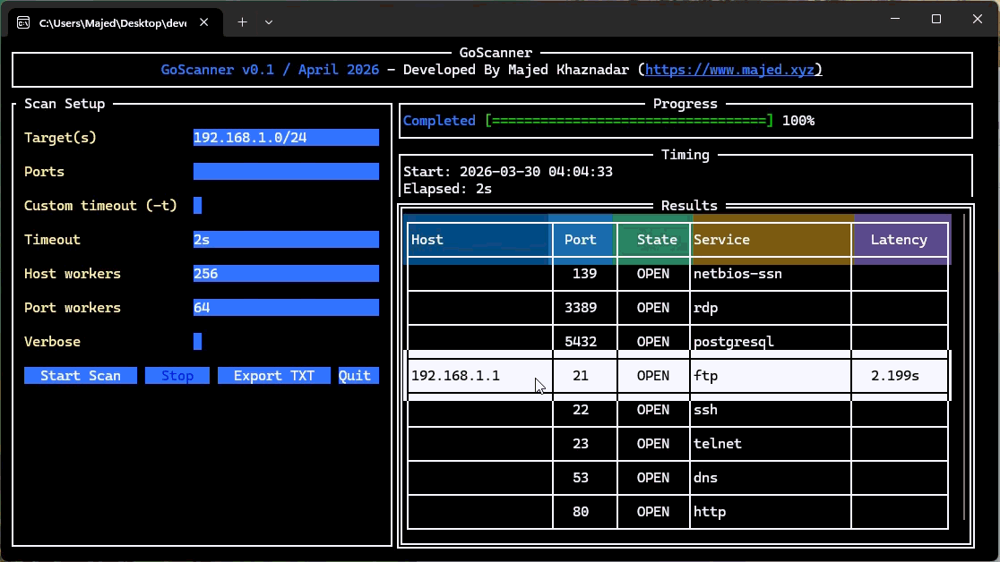

# GoScanner

GoScanner is a terminal UI port scanner written in Go. It combines a concurrent TCP scanner with a live TUI so you can enter targets on the left, watch scan progress on the right, and export results to a `.txt` file when the scan is done.



## Features

- Scan single IPs such as `192.168.1.10`
- Scan domains such as `example.com`
- Scan IP ranges such as `192.168.1.1-254`
- Scan CIDR blocks such as `192.168.1.0/24`
- Scan specific ports like `22,80,443`
- Scan port ranges like `1-65535`
- Mix port syntax like `22,80,443,8000-8100`
- Live TUI progress and timing
- Export results to a timestamped `.txt` file

## TUI Layout

Left side:

- Target / domain / IP range input
- Ports input
- Custom timeout checkbox with timeout textbox
- Host worker count
- Port worker count
- Verbose checkbox
- `Start Scan`
- `Stop`
- `Export TXT`
- `Quit`

Right side:

- Progress panel
- Timing panel
- Status panel
- Results table
- Vertical scroll indicator

Top header:

- `GoScanner v0.1 / April 2026 - Developed By Majed Khaznadar (https://www.majed.xyz)`

## Before You Start

You need these tools installed:

- `Git`
- `Go`

You can verify them with:

```bash
git --version
go version
```

## Install Git

### Windows

Install Git for Windows from:

`https://git-scm.com/download/win`

Then reopen your terminal and verify:

```powershell
git --version
```

### macOS

If Git is not installed already, install Xcode Command Line Tools:

```bash
xcode-select --install
```

Then verify:

```bash
git --version
```

### Linux

Ubuntu / Debian:

```bash
sudo apt update
sudo apt install git
```

Fedora:

```bash
sudo dnf install git
```

Arch:

```bash
sudo pacman -S git
```

Then verify:

```bash
git --version
```

## Install Go

Make sure Go is installed before compiling GoScanner.

Official Go downloads:

`https://go.dev/dl/`

After installation, verify:

```bash
go version
```

### Windows

1. Download the Windows installer from `https://go.dev/dl/`
2. Run the installer
3. Open a new terminal
4. Check:

```powershell
go version
```

### macOS

Option 1: Install the official `.pkg` from `https://go.dev/dl/`

Option 2: Install with Homebrew:

```bash
brew install go
```

Then verify:

```bash
go version
```

### Linux

Option 1: Download the official tarball from `https://go.dev/dl/`

Option 2: Use your package manager.

Ubuntu / Debian:

```bash
sudo apt update
sudo apt install golang-go
```

Fedora:

```bash
sudo dnf install golang
```

Arch:

```bash
sudo pacman -S go
```

Then verify:

```bash
go version
```

## Clone The Repository

```bash
git clone https://github.com/el-capitano/GoScanner.git
cd GoScanner
```

## Compile The App

### Windows

Build the Windows executable:

```powershell
go build -o ipscanner.exe .
```

Run it:

```powershell
.\ipscanner.exe
```

### macOS

Build:

```bash
go build -o ipscanner .
```

Run:

```bash
./ipscanner
```

### Linux

Build:

```bash
go build -o ipscanner .
```

Run:

```bash
./ipscanner
```

## Run Directly From Source

If you do not want to build a binary first:

```bash
go run .
```

## Default Scan Behavior

If the ports field is left empty, GoScanner scans this default port set:

`21, 22, 23, 25, 53, 80, 110, 111, 135, 139, 143, 443, 993, 995, 1723, 3306, 3389, 5432, 5900, 8080`

Default engine settings:

- Timeout: `2s`
- Host workers: `runtime.NumCPU() * 16`
- Port workers: `64`

## Scan Workflow

When you click `Start Scan`:

- `Start Scan` becomes disabled
- `Stop` becomes enabled
- The scan starts immediately
- The progress panel updates live
- The timing panel shows start time and elapsed time
- Open-port results are appended to the results table

When the scan finishes:

- The status changes to completed
- The end time is shown
- `Start Scan` becomes enabled again
- `Stop` becomes disabled
- `Export TXT` stays enabled if results exist

When you click `Stop`:

- The running scan is cancelled
- The app returns to a ready state for another run

## Export

Clicking `Export TXT` creates a timestamped file in the project folder:

`goscanner-results-YYYYMMDD-HHMMSS.txt`

The export includes:

- App header
- Developer link
- Start time
- End time
- Elapsed time
- Hosts found
- Open-port totals
- Result rows

## Current Scan Method

The current implementation performs TCP connect scanning:

- If a TCP connection succeeds, the port is marked `OPEN`
- Otherwise, it is marked `CLOSED`

Service names are shown for a built-in set of common ports.

## Project Structure

- [main.go](/c:/Users/Majed/Desktop/development/Go/GoScan/main.go): app entrypoint
- [scanner.go](/c:/Users/Majed/Desktop/development/Go/GoScan/scanner.go): scan engine, parsing, concurrency, and scan tracking
- [tui.go](/c:/Users/Majed/Desktop/development/Go/GoScan/tui.go): TUI layout, buttons, progress, timing, results table, scrollbar, and TXT export
- [go.mod](/c:/Users/Majed/Desktop/development/Go/GoScan/go.mod): module and dependencies

## Notes

- Full-range scans such as `1-65535` are supported, but they naturally take longer than the default port list.
- Results are exported only for discovered open-port hosts currently shown by the UI.
- If `go version` does not work after installation, reopen the terminal so your PATH is refreshed.
